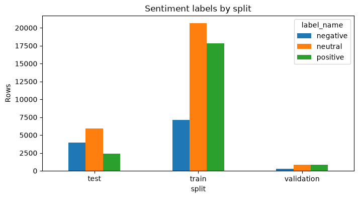
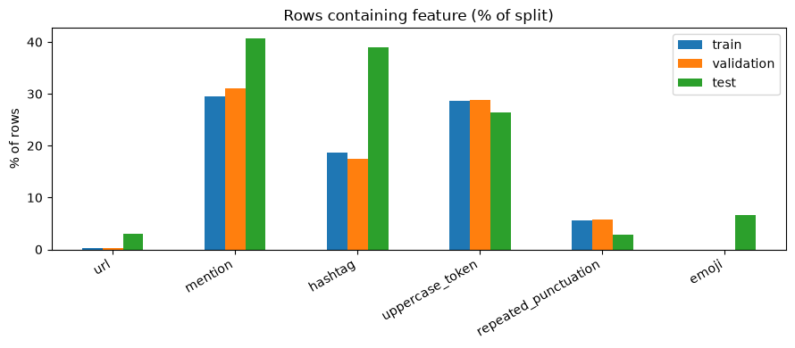
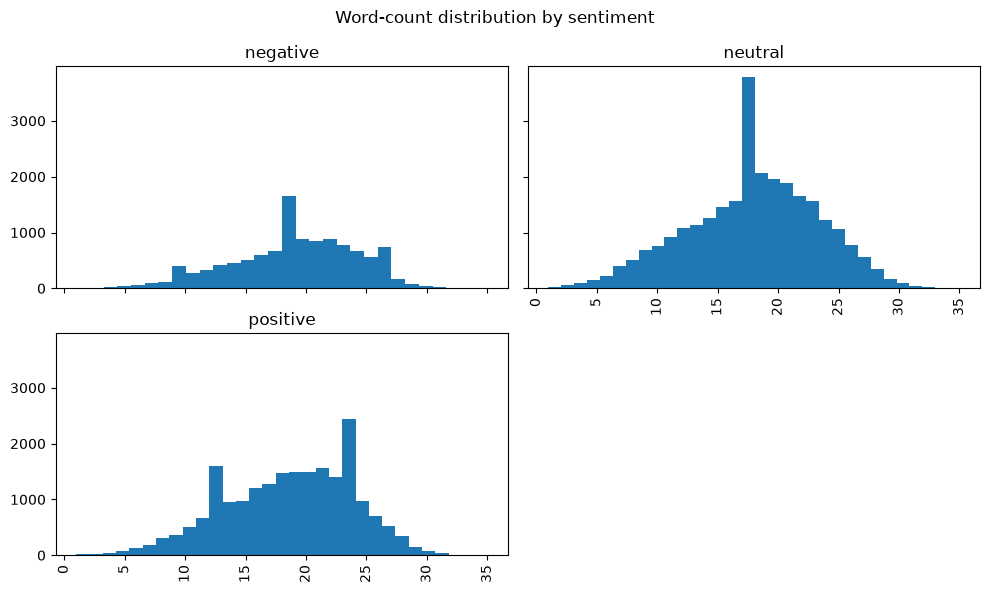

# 01 — What the TweetEval data actually is

**Measured:** 19 August 2026, from [`model/notebooks/eda.ipynb`](../../model/notebooks/eda.ipynb).
The conflicting-label count is the only figure checked outside the notebook.

## Shape and labels

- 59,899 rows, columns `text` and `label`, published splits used unchanged.
- Label feature is `ClassLabel(names=['negative','neutral','positive'])`, so `0/1/2` is the
  dataset's own encoding. Nothing is remapped.

| Split | Rows | negative | neutral | positive |
|---|---:|---:|---:|---:|
| train | 45,615 | 7,093 (15.55%) | 20,673 (45.32%) | 17,849 (39.13%) |
| validation | 2,000 | 312 (15.60%) | 869 (43.45%) | 819 (40.95%) |
| test | 12,284 | 3,972 (32.33%) | 5,937 (48.33%) | 2,375 (19.33%) |

## Test is drawn differently from train

The finding that shapes everything else.

- Negative doubles, 15.55% → 32.33%. Positive halves, 39.13% → 19.33%.
- Validation tracks train, not test.
- Confirms macro-F1 as the selector; accuracy or weighted-F1 would reward the wrong prior.
- Class weights come from train, so they are miscalibrated against test by construction. Correct
  trade — fitting on test leaks — but the README must say so.
- Tuning happens on validation. Nothing is tuned on test.

The text differs too, on nearly every axis:

| % of rows containing | train | validation | test |
|---|---:|---:|---:|
| url | 0.20 | 0.25 | **3.06** |
| mention | 29.44 | 31.05 | 40.67 |
| hashtag | 18.64 | 17.55 | **38.95** |
| uppercase_token | 28.67 | 28.90 | 26.46 |
| repeated_punctuation | 5.65 | 5.70 | 2.85 |
| emoji | **0.00** | **0.00** | **6.59** |

- Emoji: 0 of 45,615 train rows, 0 of 2,000 validation, 809 of 12,284 test.
- Untouched, every test emoji is `[UNK]` to DistilBERT and dropped by TF-IDF. Demojized, a flame
  becomes `fire`, which occurs in training text as an ordinary word.
- That makes note 09 a bridge between two distributions, not tidying.
- URLs are 15× more common in test; hashtags roughly double.

## Text length

- Train and validation average 19–20 words; test averages 14–17. Test tweets are shorter.
- Mean characters: train 106–112, validation 107–112, test 84–101.
- Within every split, negative is longest and positive shortest. Max observed 200 words.
- Wordpiece lengths for DistilBERT's `max_length` are not measured here — stage 4.

## Quality and leakage

| Check | Result |
|---|---|
| Empty or missing text | 0 |
| Invalid labels | 0 |
| Texts crossing a split boundary | 0 |
| Duplicate text rows | 54, all within a single split |
| Same text, conflicting labels | 3 texts / 6 rows |

- No leakage. The 3 conflicting pairs are negligible and left alone.
- Zero rows become empty after `normalize` or `to_bow`, on any split. No empty-string guard is
  needed downstream.

## Encoding artifacts

Concentrated almost entirely in train:

| Rows containing | train | validation | test |
|---|---:|---:|---:|
| escaped unicode (`\u002c`) | 5,111 | 206 | 0 |
| HTML entity (`&amp;`) | 1,917 | 88 | 4 |
| leading `"` | 9,368 | 397 | 137 |

- Only two escape codes exist corpus-wide: `\u002c` (comma, 4,843) and `\u2019`
  (apostrophe, 4,589). Entities are mostly `&amp;`, with a tail of `&gt;`, `&lt;`, `&quot;`.
- NFKC does not touch a literal backslash-u sequence, so these survived `normalize`, and
  `to_bow` then shredded them: `\u002c` → `u c`, `&amp;` → `amp`.
- The baseline was learning `u`, `c` and `amp` as features from training rows at a rate that
  essentially never occurs at serving time.

**Fix:** an expansion step in `normalize`, ahead of NFKC, running HTML unescape and `\uXXXX`
substitution to a fixed point.

| Rows with junk token | train | validation | test |
|---|---:|---:|---:|
| `u c` | 2,997 → **1** | 122 → **0** | 2 → **2** |
| `amp` | 1,747 → **4** | 82 → **0** | 2 → **0** |

- Survivors are genuine — "amp" for amplifier, and two test rows containing the letters.
- The fix removes a train-only contamination, moving train closer to both test and production.
- Fixed point, not one pass: 5 rows carry double-encoded `&amp;amp;`, which a single unescape
  leaves as `&amp;` and breaks the idempotence that makes the cleaner safe at serving time.
  Every expansion shortens the string, so the loop terminates.
- Leading quotes left alone: stripped by the bag-of-words stage anyway, and an ordinary token
  for DistilBERT.

## Other structure

- **Hashtags**, 18.64% of train, `#NHL` through `#HappyBirthdayRemusLupin`. No special handling —
  `normalize` keeps them for DistilBERT's tokenizer, `to_bow` strips the `#` and keeps the word.
  Segmenting run-together hashtags needs a dictionary and is not worth it.
- **Mentions** are already partly normalised to `@user`, but other handles remain, so the rule
  still has work to do.
- **URLs** are rare in train (0.20%) and are not pre-replaced with a token.
